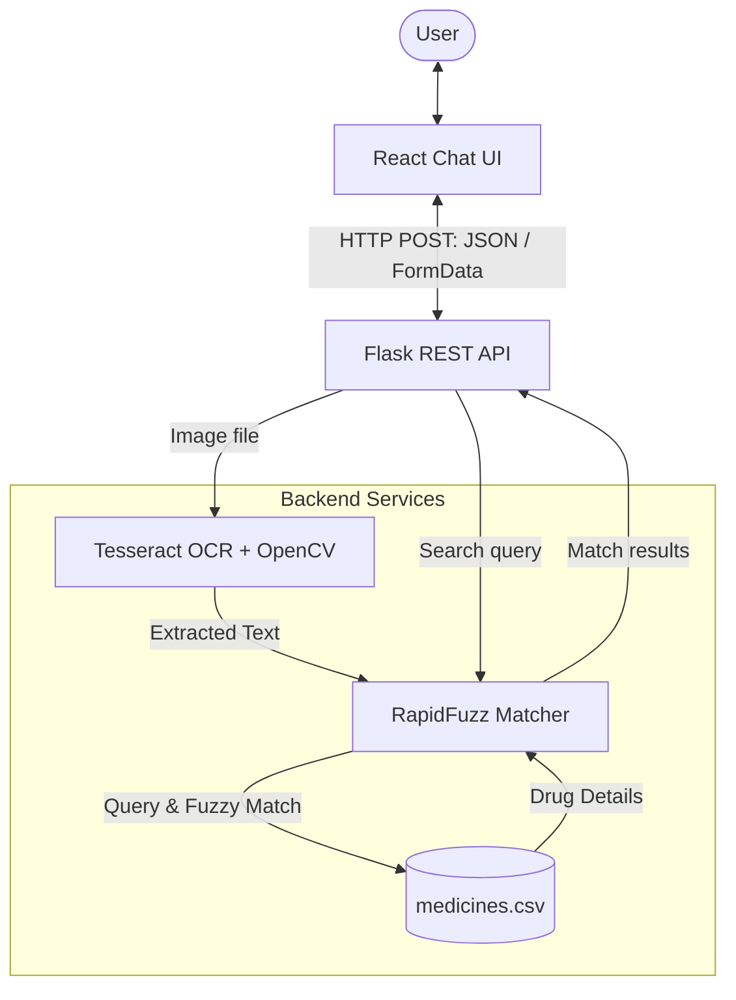

# Smart Medicine AI - Medical Small Language Model (SLM) & OCR System

Welcome to the **Smart Medicine AI** project. This repository contains a lightweight, full-stack application designed to search for and retrieve drug information (Uses, Side Effects, Dosage, and Precautions) using either direct text queries or by scanning medicine package labels via Optical Character Recognition (OCR).

This document serves as both the project **README** and a **detailed blueprint/template** from which you can generate your final academic or professional project report.

---

## 📋 Table of Contents
1. [Project Overview](#-project-overview)
2. [System Architecture](#-system-architecture)
3. [Key Features](#-key-features)
4. [Technology Stack](#-technology-stack)
5. [Database Structure](#-database-structure)
6. [Core Code Implementation & Walkthrough](#-core-code-implementation--walkthrough)
7. [Installation & Setup Guide](#-installation--setup-guide)
8. [Proposed Enhancements & Future Scope](#-proposed-enhancements--future-scope)
9. [Project Report Blueprint (Structure & Writing Guide)](#-project-report-blueprint-structure--writing-guide)

---

## 🌟 Project Overview

When purchasing medicines, consumers often struggle to quickly find reliable information regarding drug usages, side effects, precautions, and appropriate dosages. Searching the web can lead to conflicting information. Furthermore, reading fine print on medicine packaging is difficult.

**Smart Medicine AI** addresses these problems by providing:
- A conversational, conversational-style **Chatbot Interface** where users can type the name of a drug.
- An **OCR-based Image Scanner** where users can upload an image of a medicine packet. The system processes the image, extracts text, matches it with the database, and returns drug insights immediately.
- A **Fuzzy Matching Search Engine** that compensates for spelling mistakes, scan errors, or partial matches.

---

## 🏗️ System Architecture

The project is structured as a decoupled client-server architecture:



### Flow of Operations
1. **User Query**: The user types a medicine name or uploads an image of a medicine container.
2. **Frontend Dispatch**: 
   - Text inputs are sent as JSON payloads to `/search-text`.
   - Images are sent as `FormData` payloads to `/upload-image`.
3. **Backend Processing**:
   - If an image is uploaded, it is saved, read using **OpenCV**, and processed via **Tesseract OCR** to extract raw text.
   - Text is normalized (lowercased, special characters removed, split into words).
4. **Fuzzy Match Engine**: The backend queries the **RapidFuzz** processor, which checks the similarity index against the drug list in `data/medicines.csv`.
   - `/search-text` uses a strict fuzzy matching scorer with a high threshold (e.g., >70% similarity).
   - `/upload-image` uses partial ratio matching (fuzz.partial_ratio) with a lower threshold (e.g., >50%) to tolerate OCR noise and background text.
5. **UI Update**: If a match is found, the backend returns the drug card data, which the React UI displays as a structured response bubble.

---

## ✨ Key Features

- **Double Input Modality**: Supports both manual typing and camera uploads.
- **Robust OCR**: Uses Tesseract OCR to digitize textual information from complex medicine pack shots.
- **Fault-Tolerant Search**: Leverages Levenshtein-distance-based matching so that typos (e.g., "paracetaml" or "aspirin") are still correctly mapped to their database entries.
- **Clean Chat Interface**: Modern responsive chat interface built using React, featuring a dark-themed sleek UI, automatic scrolling, and visual loading states.

---

## 💻 Technology Stack

### Frontend
- **React.js (v19)**: Main web UI framework.
- **Vanilla CSS**: Clean, dark-mode-first custom styling featuring responsive layouts.
- **Fetch API**: For asynchronous API communication.

### Backend
- **Python (v3.10+)**
- **Flask (v3)**: Lightweight WSGI web application framework.
- **Flask-CORS**: To permit cross-origin resource sharing between React (running on port 3000) and Flask (running on port 5000).
- **Pandas**: Efficient CSV loading and database queries.
- **OpenCV (cv2)**: Reading/loading images on the server.
- **Tesseract OCR (pytesseract)**: Open-source optical character recognition engine.
- **RapidFuzz**: High-performance, fast fuzzy string matching.

---

## 📊 Database Structure

The project currently uses a flat-file database schema stored in `backend/data/medicines.csv`. The schema contains the following fields:

| Field Name | Type | Description | Example |
| :--- | :--- | :--- | :--- |
| `name` | String | Brand/Generic name of the drug (lowercased for matching) | `paracetamol` |
| `uses` | String | Primary medical uses of the drug | `Fever and pain relief` |
| `side_effects` | String | Common known side effects | `Nausea` |
| `dosage` | String | Recommended default dosage | `500mg` |
| `precautions` | String | Warnings and precautions for consumption | `Do not overdose` |

*Sample Entries:*
```csv
name,uses,side_effects,dosage,precautions
paracetamol,Fever and pain relief,Nausea,500mg,Do not overdose
ibuprofen,Pain and inflammation,Stomach irritation,200mg,Take after food
amoxicillin,Bacterial infections,Rash,500mg,Complete full course
```

---

## 🔍 Core Code Implementation & Walkthrough

Here are the key implementation blocks that drive the system:

### 1. Flask Server (`backend/app.py`)
Responsible for routing, handling file uploads, cleaning string payloads, and orchestrating OCR processes.
- **Endpoint `/search-text`**: Handles simple string match requests.
- **Endpoint `/upload-image`**: Saves the incoming image, runs CV2 and Pytesseract OCR to convert the image to string, cleans the text, and feeds it to the fuzzy matcher.

### 2. Fuzzy Matcher Engine (`backend/utils/matcher.py`)
Uses the `rapidfuzz` library to perform similarity scoring:
```python
from rapidfuzz import process, fuzz
import pandas as pd

data = pd.read_csv('data/medicines.csv')

def find_medicine(name):
    names = data['name'].tolist()
    match = process.extractOne(name.lower(), names)
    # Require strong match (>70%) for direct search
    if match and match[1] > 70:
        result = data[data['name'] == match[0]].iloc[0]
        return result.to_dict()
    return None

def find_medicine_from_text(text):
    names = data['name'].tolist()
    # Use fuzz.partial_ratio for OCR text containing full labels
    match = process.extractOne(
        text.lower(),
        names,
        scorer=fuzz.partial_ratio
    )
    # Lower threshold (>50%) to tolerate OCR misread characters
    if match and match[1] > 50:
        result = data[data['name'] == match[0]].iloc[0]
        return result.to_dict()
    return None
```

### 3. Frontend Chat Client (`frontend/src/App.js`)
An asynchronous React component that manages chat lists, handles file selection, uploads image payloads using `FormData`, and appends structured response text into a CSS flexbox container with auto-scrolling capabilities.

---

## ⚙️ Installation & Setup Guide

### Prerequisites
1. **Python 3.10+** installed.
2. **Node.js (v18+)** and `npm` installed.
3. **Tesseract OCR** installed on your system.
   - For Windows, download the installer and install it to a location such as `C:\Users\<YourUsername>\AppData\Local\Programs\Tesseract-OCR\tesseract.exe`.
   - Update the path in line 7 of `backend/app.py` if necessary:
     ```python
     pytesseract.pytesseract.tesseract_cmd = r"C:\path\to\tesseract.exe"
     ```

### 1. Setup Backend
Open a terminal in the root folder:
```bash
# Navigate to backend
cd backend

# Create virtual environment
python -m venv venv

# Activate virtual environment
# On Windows:
.\venv\Scripts\activate
# On macOS/Linux:
source venv/bin/activate

# Install dependencies
pip install -r requirements.txt

# Run Flask application
python app.py
```
*The server will start running on `http://127.0.0.1:5000`.*

### 2. Setup Frontend
Open another terminal:
```bash
# Navigate to frontend
cd frontend

# Install packages
npm install

# Start local React server
npm start
```
*The browser should automatically open `http://localhost:3000` containing the web client.*

---

## 🚀 Proposed Enhancements & Future Scope

To extend this prototype into a full-scale medical tool, the following enhancements are suggested:
1. **Large Scale Database Integration**: Connect to open-source medical databases (e.g., RxNorm, OpenFDA APIs) to support millions of drugs instead of a local CSV.
2. **Generative LLM Integration (Medical SLM)**: Replace or supplement fuzzy matching with a Local Small Language Model (e.g., **Gemma 2B** or **Llama 3 8B** running locally via Ollama) to answer medical questions about the matched medicine.
3. **Enhanced OCR Image Pipeline**: Implement OpenCV prep steps like thresholding, dilation, and deskewing to optimize OCR accuracy under poor lighting conditions.
4. **User History & Accounts**: Securely persist user search history and drug prescriptions using SQLite or PostgreSQL.

---

## 📄 Project Report Blueprint (Structure & Writing Guide)

*Use this outline to expand this README into your formal project report submission.*

### Section 1: Abstract
*   **What to write:** A single paragraph summarizing the objective, methodology (React + Flask + OCR + Fuzzy Matching), and the final result of the system.

### Section 2: Introduction & Problem Statement
*   **What to write:** Discuss the challenges people face in understanding their medications. Highlight why search engines are inadequate (lack of structured formatting) and why a mobile scan-and-check application is valuable.

### Section 3: Literature Survey & Background
*   **What to write:** Review existing approaches in health informatics. Discuss OCR technologies (such as Tesseract, Google Cloud Vision) and text matching strategies (regex matching vs. fuzzy matching vs. NLP models).

### Section 4: System Design & Methodology
*   **What to write:**
    *   **Architecture Diagram:** Recreate or export the Mermaid diagram.
    *   **Backend Design:** Discuss why Flask was chosen, how OpenCV handles the image upload, and how pytesseract handles OCR.
    *   **Matching Algorithms:** Explain the Levenshtein distance concept behind `rapidfuzz` and how `fuzz.partial_ratio` works for OCR.
    *   **Frontend Design:** Describe the state-driven React model that mimics a chatbot.

### Section 5: Implementation Details
*   **What to write:** Show key snippets of code (found in `app.py` and `matcher.py`) and explain how data flows from the image input on screen to the JSON response from the server.

### Section 6: Results & Discussion
*   **What to write:** Detail test cases:
    *   *Case 1:* Text search matching exactly ("aspirin").
    *   *Case 2:* Text search matching with spelling mistakes ("paracetaml" -> matched to Paracetamol).
    *   *Case 3:* Image upload of a medicine packet showing text extraction success.
    *   *Case 4:* Failures or limitations (e.g., blurry images failing OCR).

### Section 7: Conclusion & Future Scope
*   **What to write:** Summarize the project achievements, and lay out plans to implement a true Medical Small Language Model (SLM) for generative dialogue.

---
*Created for Smart Medicine AI Project Report Preparation.*
